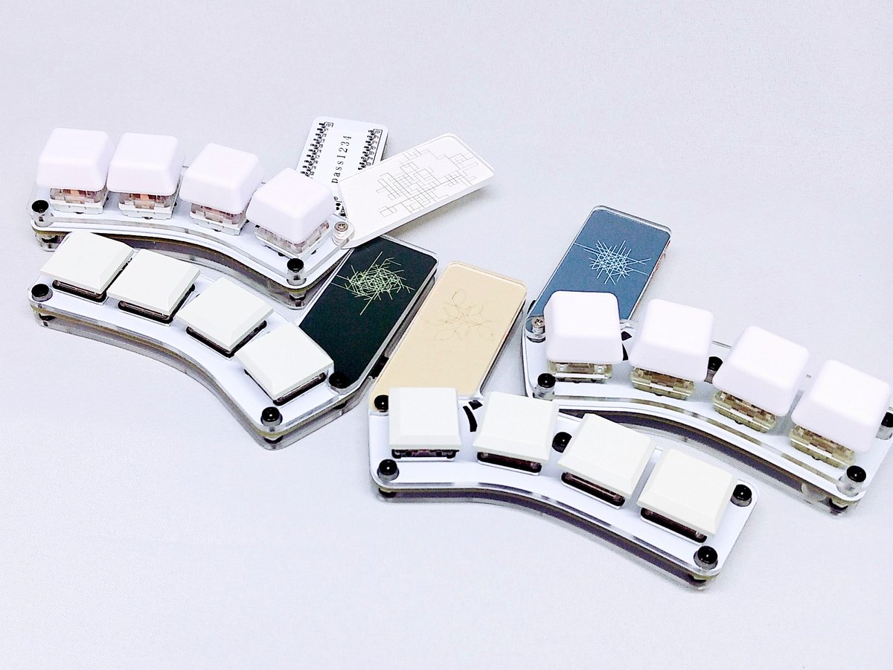
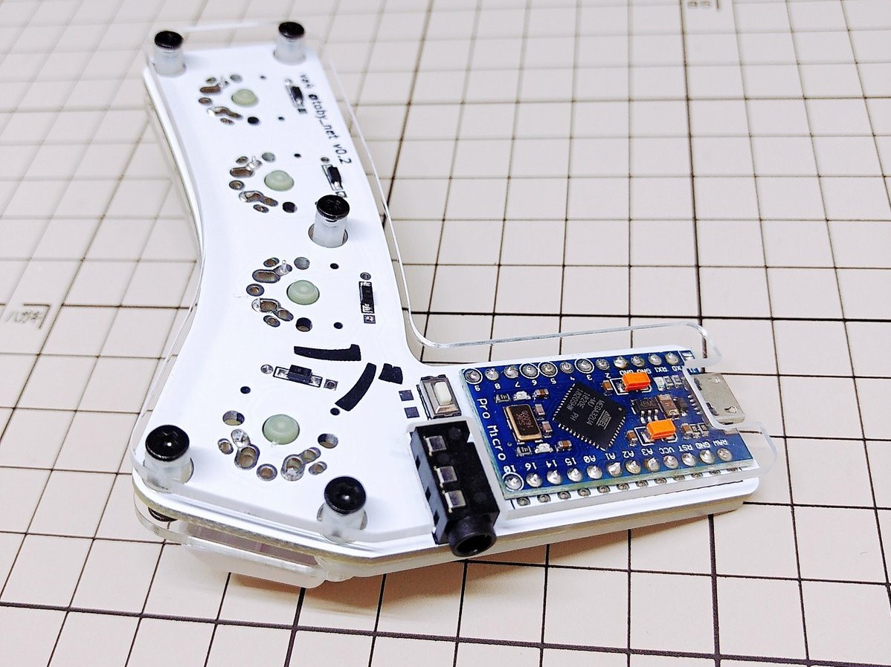
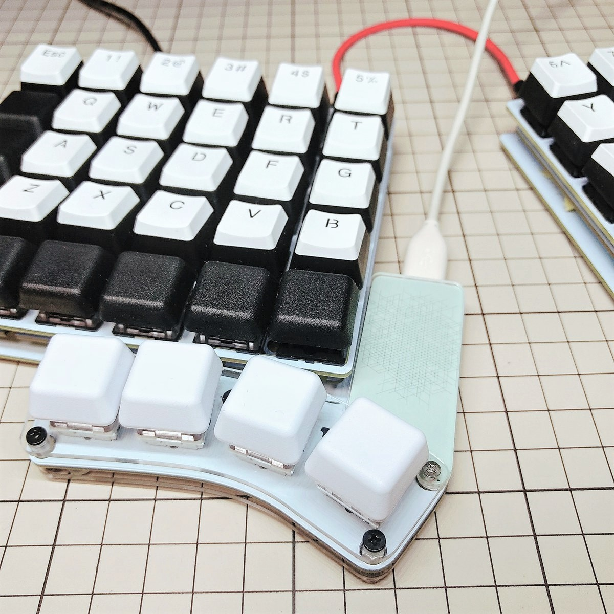

# The DIY Keyboard `va4`

`va4` the 4x2 key split keyboard.

G20 Profile Keycaps + CherryMX Compatible Key Switch version:

Kailh Choc(Low profile) Key Switch version:

## Features

* Support `Cherry MX Compatible Switch` and `Kailh Low Profile Choc Switch`

  

* Support `Pro Micro` compatible board

  

* Password writing space

  

* Columbus' egg included

  

* Open Source License
