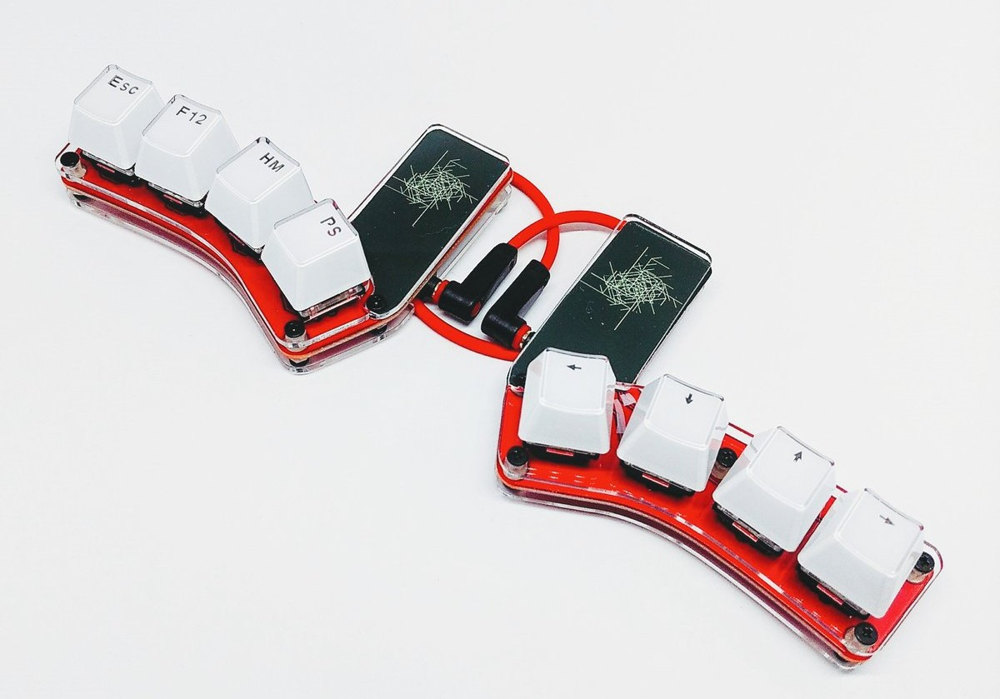
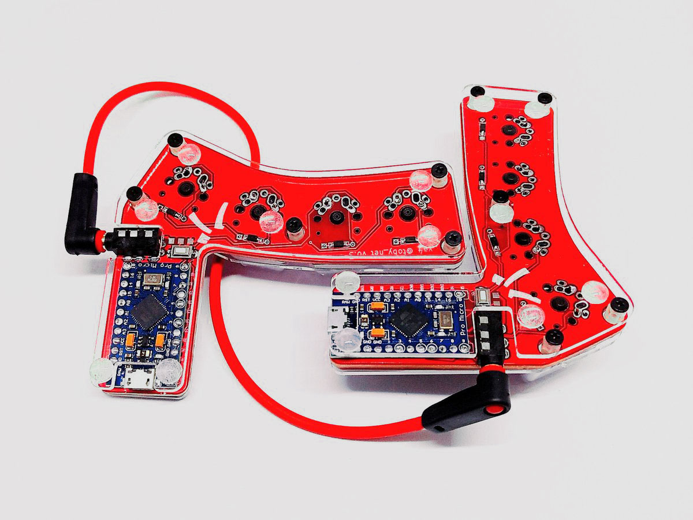

# The DIY Keyboard `va4` (v0.3.x)

`va4` the 4x2 key split keyboard.

**`OEM Profile Keycaps` + `CherryMX Compatible Switch`** version: (`v0.3.0`)

**`G20 Profile Keycaps` + `CherryMX Compatible Switch`** version: (`v0.2.0`)

**`Kailh Choc(Low profile)` Key Switch** version: (`v0.2.0`)

## Features

* Support `Cherry MX Compatible Switch` and `Kailh Low Profile Choc Switch`

  

* Support `Pro Micro` compatible board

  

* Password writing space

  

* Columbus' egg included

  

* Open Source License
